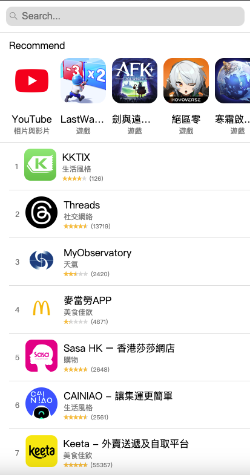

# 项目名称
App Store列表⾴⾯-应用列表

# 技术栈
Vue 3 + TypeScript + Vite

# 启动步骤
``` bash
npm install

npm run dev

npm run build
```

# 效果图


# 功能支持
✅ 支持搜索

# 友情链接
Apple(App Store)的公开API

## 最受歡迎的Apps
● https://itunes.apple.com/hk/rss/topgrossingapplications/limit=${limit}/json

## 免费的Apps
● https://itunes.apple.com/hk/rss/topfreeapplications/limit=${limit}/json

## Apps详情
● https://itunes.apple.com/hk/lookup?id=${id}
    ○ 此API可接受多個id，⽤“,”拼接。例如 lookup?id=123,456,789